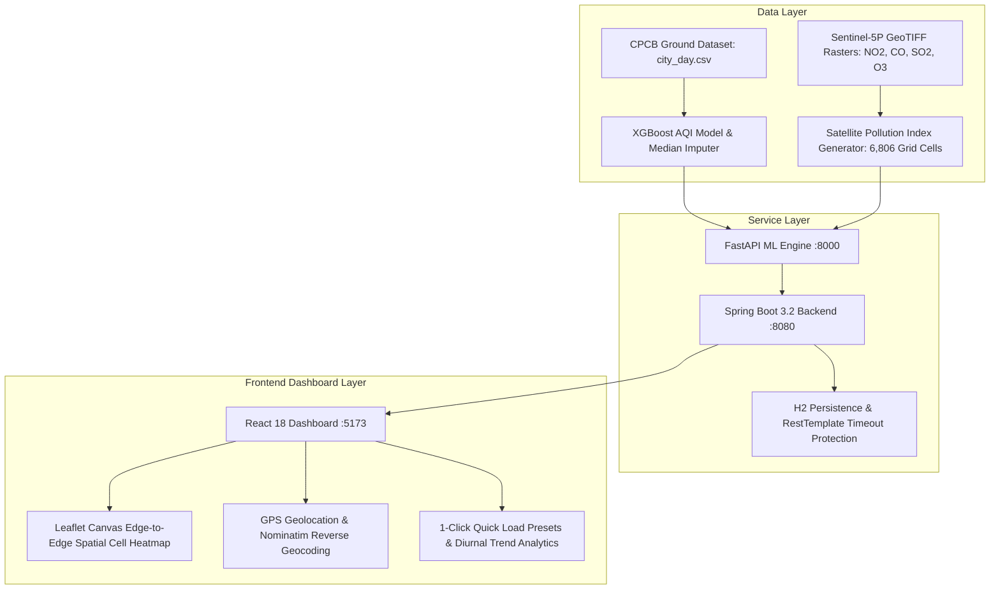

# 🌍 SmartAQI - AI-Powered Satellite & Ground Air Quality Calculator


---

## 📌 Problem Statement

India faces severe air quality challenges, but existing monitoring infrastructure suffers from three critical limitations:

1. **Sparse Spatial Coverage**: Official CPCB ground monitoring stations (CAAQMS) are concentrated primarily in Tier-1 metropolitan hubs. Vast rural, semi-urban, and industrial regions lack real-time AQI visibility.
2. **Missing Atmospheric Sensors**: Ground stations frequently suffer missing sensor channels (e.g. missing PM2.5 or NH3 readings), requiring robust median imputation pipelines for accurate standard CPCB AQI calculation.
3. **Satellite Data Misinterpretation**: Raw Sentinel-5P TROPOMI satellite data measures vertical column density ($\text{mol/m}^2$) rather than ground surface concentrations ($\mu\text{g/m}^3$), rendering standard ground models inaccurate if applied directly without dedicated Satellite Pollution Indexing (SPI).

---

## 💡 How the Problem Is Solved

SmartAQI delivers an **honest, dual-layer air quality architecture**:



### Key Architectural Highlights:
- **Layer 1: CPCB Ground AQI Engine**: Trained XGBoost regressor predicting official CPCB Air Quality Index ($0\text{--}500+$) across 6 categories (`Good`, `Satisfactory`, `Moderate`, `Poor`, `Very Poor`, `Severe`) using 12 atmospheric parameters (`PM2.5`, `PM10`, `NO`, `NO2`, `NOx`, `NH3`, `CO`, `SO2`, `O3`, `Benzene`, `Toluene`, `Xylene`).
- **Layer 2: Satellite Pollution Index (SPI)**: Direct spatial sampling across **6,806 Indian grid cells** derived from Sentinel-5P gas channels (`NO2`, `CO`, `SO2`, `O3`).
- **Edge-to-Edge Canvas Heatmap**: Rendered as continuous 0.35° filled `Rectangle` shapes using `preferCanvas={true}` for high-performance zero-lag rendering.
- **GPS Geolocation & Reverse Geocoding**: Integrated `navigator.geolocation` with OpenStreetMap Nominatim (`nominatim.openstreetmap.org/reverse`) to reverse-geocode coordinates into place names (e.g. *"Near Andheri, Mumbai"*).
- **Nearest-Point AQI API (`GET /point-aqi`)**: Returns nearest grid point AQI and pollutant concentrations for any latitude/longitude coordinate in India.

---

## 🛠️ Repository Structure

```
AI_AQI_CALCULATOR/
├── backend/backend/           # Spring Boot 3.2 Java Backend
│   ├── src/main/java/com/smartaqi/backend/
│   │   ├── controller/        # PredictionController (/api/predict, /api/grid-aqi, /api/point-aqi)
│   │   ├── dto/               # PredictionRequest & PredictionResponse
│   │   ├── entity/            # PredictionEntity (JPA H2 DB)
│   │   └── service/           # PredictionService & FastApiClient
│   └── pom.xml
├── datasets/
│   ├── raw/city_day.csv       # Ground training dataset
│   └── processed/grid_aqi.json# Canonical 6,806 spatial grid dataset
├── frontend/                  # React 18 + Vite + TailwindCSS Frontend
│   ├── src/
│   │   ├── components/        # IndiaMapCard, PredictionForm, AQISummary, etc.
│   │   ├── context/           # PredictionContext (Location & Dark Mode State)
│   │   └── data/              # Synchronized locationsData.js (22 major cities)
├── ml/                        # Python FastAPI Machine Learning Service
│   ├── api.py                 # FastAPI endpoints (/predict, /grid-aqi, /point-aqi)
│   └── test_api.py            # Automated pytest test suite
├── models/                    # Trained model artifacts (aqi_model.pkl, imputer.pkl)
├── scripts/                   # Data processing & model training scripts
├── docker-compose.yml         # Containerized stack configuration
└── requirements.txt           # Python dependencies
```

---

## ⚡ Quick Start Guide

### Prerequisites
- **Python 3.12+**
- **Java OpenJDK 17+** & **Maven**
- **Node.js 18+** & **npm**

### Step 1: Start FastAPI ML Service
```bash
.\venv\Scripts\python.exe -m uvicorn ml.api:app --host 127.0.0.1 --port 8000 --reload
```

### Step 2: Start Spring Boot Backend
```bash
cd backend/backend
.\mvnw.cmd spring-boot:run
```

### Step 3: Start React Frontend
```bash
cd frontend
npm run dev
```

Visit **`http://localhost:5173`** in your browser!

---

## 📡 API Reference

| Service | Method | Endpoint | Description |
| :--- | :--- | :--- | :--- |
| **FastAPI** | `GET` | `/` | Service health status |
| **FastAPI** | `GET` | `/grid-aqi` | Canonical 6,806 spatial cell grid dataset |
| **FastAPI** | `GET` | `/point-aqi?lat=...&lon=...` | Nearest spatial cell lookup |
| **FastAPI** | `POST` | `/predict` | XGBoost AQI prediction from 12 gases |
| **Spring Boot** | `GET` | `/api/grid-aqi` | Proxied spatial grid dataset |
| **Spring Boot** | `GET` | `/api/point-aqi?lat=...&lon=...` | Proxied nearest spatial cell lookup |
| **Spring Boot** | `POST` | `/api/predict` | Validated AQI prediction & H2 persistence |
| **Spring Boot** | `GET` | `/api/predictions/recent` | Top 10 recent historical predictions |

---

## 🧪 Automated Testing

Run the automated Pytest suite:
```bash
.\venv\Scripts\python.exe -m pytest ml/test_api.py -v
```

---

## 📄 License
This project is open-source under the [MIT License](LICENSE).