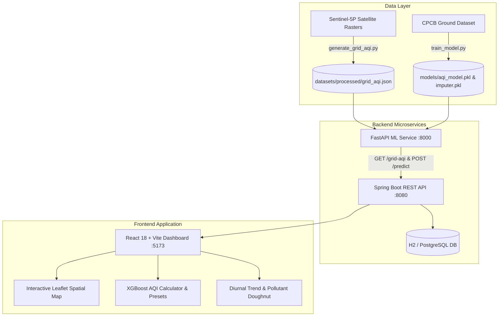

# SmartAQI — AI-Powered Urban Air Quality Intelligence Platform

[](https://www.python.org/)
[](https://fastapi.tiangolo.com/)
[](https://spring.io/projects/spring-boot)
[](https://react.dev/)
[](https://leafletjs.com/)
[](LICENSE)

SmartAQI is an end-to-end, multi-tier AI platform for urban air quality monitoring, ML-based CPCB AQI prediction, and Sentinel-5P satellite pollution mapping across India.

---

## 📌 Problem Statement

1. **Sparse Spatial Coverage of Ground Stations**: Ground-level Continuous Ambient Air Quality Monitoring Stations (CAAQMS) are concentrated primarily in major metropolitan centers (e.g., Delhi, Mumbai, Bengaluru). Millions of people living in Tier-2/3 cities, industrial corridors, and rural regions lack localized air quality data.
2. **Missing Sensor Readings & Feature Gaps**: Ground stations frequently suffer from missing sensor parameters (e.g., missing PM2.5 or NH3 channels) due to sensor calibration outages, requiring robust imputation.
3. **Satellite Data Misinterpretation**: Raw satellite instruments (such as Sentinel-5P TROPOMI) measure vertical atmospheric column densities ($\text{mol/m}^2$) rather than ground-level surface concentrations ($\mu\text{g/m}^3$). Feeding raw satellite gas layers directly into ground-station models produces misleading or uniform AQI readings without spatial calibration.

---

## 💡 How the Problem Is Solved

SmartAQI solves these challenges through a **Dual-Layer Modeling Architecture**:

1. **XGBoost Ground AQI ML Model (CPCB Standard)**:
   - Trained on historical Indian CPCB city dataset (`PM2.5`, `PM10`, `NO2`, `SO2`, `CO`, `O3`, `NH3`, `NO`, `NOx`, `Benzene`, `Toluene`, `Xylene`).
   - Uses `SimpleImputer` for handling missing pollutant parameters seamlessly.
   - Returns official CPCB AQI values (0–500+) and categories (`Good`, `Satisfactory`, `Moderate`, `Poor`, `Very Poor`, `Severe`).

2. **Satellite Pollution Index (SPI) Spatial Grid**:
   - Samples 5 satellite gas channels from Sentinel-5P GeoTIFF data across a 6,806-point coordinate grid covering the entire Indian landmass (Lat 8.0°–37.0°, Lon 68.5°–97.0°).
   - Computes an honest, direct **Satellite Pollution Index (SPI)** ($0\text{--}100+$) derived from `NO2`, `CO`, `SO2`, and `O3` atmospheric column densities.
   - Provides continuous spatial coverage even in regions with no physical ground monitoring stations.

3. **Multi-Tier Microservice Platform**:
   - **FastAPI ML Service**: High-performance Python backend serving live model inference (`POST /predict`) and precomputed spatial grid datasets (`GET /grid-aqi`).
   - **Spring Boot 3.2 Backend**: Enterprise Java REST API providing input validation, request proxying, timeout protection (`RestTemplateBuilder`), and database persistence (`PredictionEntity`).
   - **React 18 + Vite Frontend**: Responsive dashboard featuring interactive Leaflet maps with city search, smooth map fly-to animations, diurnal trend charts, pollutant breakdown doughnuts, and dynamic AI health advisories.

---

## 🏗️ System Architecture



---

## ✨ Key Features

- **All-India Interactive Satellite Map**: Renders 6,806 Sentinel-5P grid points with dynamic CPCB color markers and interactive popups.
- **Instant City Search & Map Fly-To**: Search any Indian city (e.g. Delhi, Mumbai, Bengaluru, Patna) with instant autocomplete to smoothly pan/zoom the map.
- **Official CPCB AQI Predictor**: Predict AQI using 12 atmospheric parameters with 1-click quick presets (`Delhi Severe`, `Mumbai Moderate`, `Bengaluru Satisfactory`, `Clean Mountain Air`).
- **Dynamic AI Health Recommendations**: Automatically generates health warnings (N95 mask advice, outdoor risk assessments) tailored to active AQI levels.
- **Diurnal Pollution Trends & Breakdown**: Interactive Chart.js visualizers showing 24-hour AQI curves and pollutant concentration breakdown.
- **Dark / Light Theme Toggle**: Full support for dark mode across all dashboard cards and topbar controls.

---

## 📁 Repository Structure

```
AI_AQI_calculator/
├── backend/
│   ├── Dockerfile                  # Multi-stage Maven/JRE Dockerfile
│   └── backend/                    # Spring Boot 3.2 project
│       ├── pom.xml
│       └── src/main/java/com/smartaqi/backend/
│           ├── config/             # RestClientConfig.java
│           ├── controller/         # PredictionController.java
│           ├── dto/                # PredictionRequest, PredictionResponse, ErrorResponse
│           ├── entity/             # PredictionEntity.java
│           ├── exception/          # GlobalExceptionHandler.java
│           ├── repository/         # PredictionRepository.java
│           └── service/            # FastApiClient.java, PredictionService.java
├── datasets/
│   ├── processed/grid_aqi.json     # Canonical 6,806-point Satellite Grid Dataset
│   └── raw/historical/city_day.csv # CPCB historical dataset
├── frontend/                       # React 18 + Vite frontend
│   ├── Dockerfile
│   ├── package.json
│   └── src/
│       ├── components/             # Dashboard, Map, & Prediction components
│       ├── context/                # PredictionContext.jsx
│       ├── data/                   # locationsData.js (22 major Indian cities)
│       ├── layouts/                # MainLayout.jsx
│       ├── pages/                  # Dashboard, Prediction, Analytics, Map, About
│       └── services/               # api.js (Axios instance)
├── ml/                             # FastAPI ML Service
│   ├── Dockerfile
│   ├── api.py                      # FastAPI application (lifespan model & grid loader)
│   └── test_api.py                 # Pytest unit test suite (23 test cases)
├── models/
│   ├── aqi_model.pkl               # Trained XGBoost regressor
│   └── imputer.pkl                 # SimpleImputer pipeline
├── scripts/
│   ├── data_processing/
│   │   ├── generate_grid_aqi.py   # Satellite grid generator script
│   │   └── inspect_and_sample_tifs.py
│   └── model/
│       └── train_model.py          # Model training script
├── docker-compose.yml              # One-command full-stack container orchestration
├── requirements.txt                # Essential Python dependencies
└── README.md
```

---

## 🚀 How to Run the Project

### Prerequisites
- **Python**: 3.10 or higher
- **Node.js**: v18 or higher & `npm`
- **Java JDK**: 17 or higher (for Spring Boot backend)
- *(Optional)* **Docker Desktop** (for containerized deployment)

---

### Option 1: Running Microservices Individually (Local Development)

#### Step 1 — Set Up Python Environment & Run FastAPI ML Service
```powershell
# Create & activate virtual environment
python -m venv venv
.\venv\Scripts\Activate.ps1

# Install requirements
pip install -r requirements.txt

# Start FastAPI ML Service on port 8000
uvicorn ml.api:app --host 127.0.0.1 --port 8000 --reload
```
> **Endpoints**:
> - Health Check: `http://127.0.0.1:8000/`
> - Satellite Grid Dataset: `http://127.0.0.1:8000/grid-aqi`
> - Swagger Interactive Docs: `http://127.0.0.1:8000/docs`

#### Step 2 — Run Spring Boot Backend Service
Open a second terminal window:
```powershell
cd backend\backend

# Build & run Spring Boot application on port 8080
.\mvnw.cmd spring-boot:run
```
> **Endpoints**:
> - Predict AQI: `POST http://localhost:8080/api/predict`
> - Recent History: `GET http://localhost:8080/api/predictions/recent`
> - Satellite Grid Proxy: `GET http://localhost:8080/api/grid-aqi`

#### Step 3 — Run React Frontend Application
Open a third terminal window:
```powershell
cd frontend

# Install Node dependencies (first time only)
npm install

# Start Vite development server
npm run dev
```
> Open your web browser at **`http://localhost:5173`** to access the live dashboard!

---

### Option 2: Running the Entire Stack via Docker Compose
If you have Docker Desktop installed and running:

```powershell
docker-compose up --build
```

This starts all four services automatically:
- **React Frontend**: `http://localhost:80`
- **Spring Boot API**: `http://localhost:8080`
- **FastAPI ML Service**: `http://localhost:8000`
- **PostgreSQL Database**: `localhost:5432`

---

## 🧪 Running Unit Tests

To run the Python test suite verifying API endpoints, AQI category boundaries, payload validation, and grid dataset loading:

```powershell
.\venv\Scripts\python.exe -m pytest ml\test_api.py -v
```

> **Test Results**: All **23 / 23 test cases pass** cleanly.

---

## 🔌 API Reference

| Service | Method | Endpoint | Description |
|---------|--------|----------|-------------|
| FastAPI | `GET` | `/` | Health check (`{"status": "SmartAQI API Running"}`) |
| FastAPI | `GET` | `/grid-aqi` | Returns precomputed 6,806-point satellite grid array |
| FastAPI | `POST` | `/predict` | Predicts AQI from 12 pollutant parameters |
| Spring Boot | `POST` | `/api/predict` | Validates request, calls FastAPI, persists to DB |
| Spring Boot | `GET` | `/api/predictions/recent` | Returns latest 10 saved prediction records |
| Spring Boot | `GET` | `/api/grid-aqi` | Proxies satellite grid dataset to frontend |

---

## 📜 License

This project is licensed under the [MIT License](LICENSE).